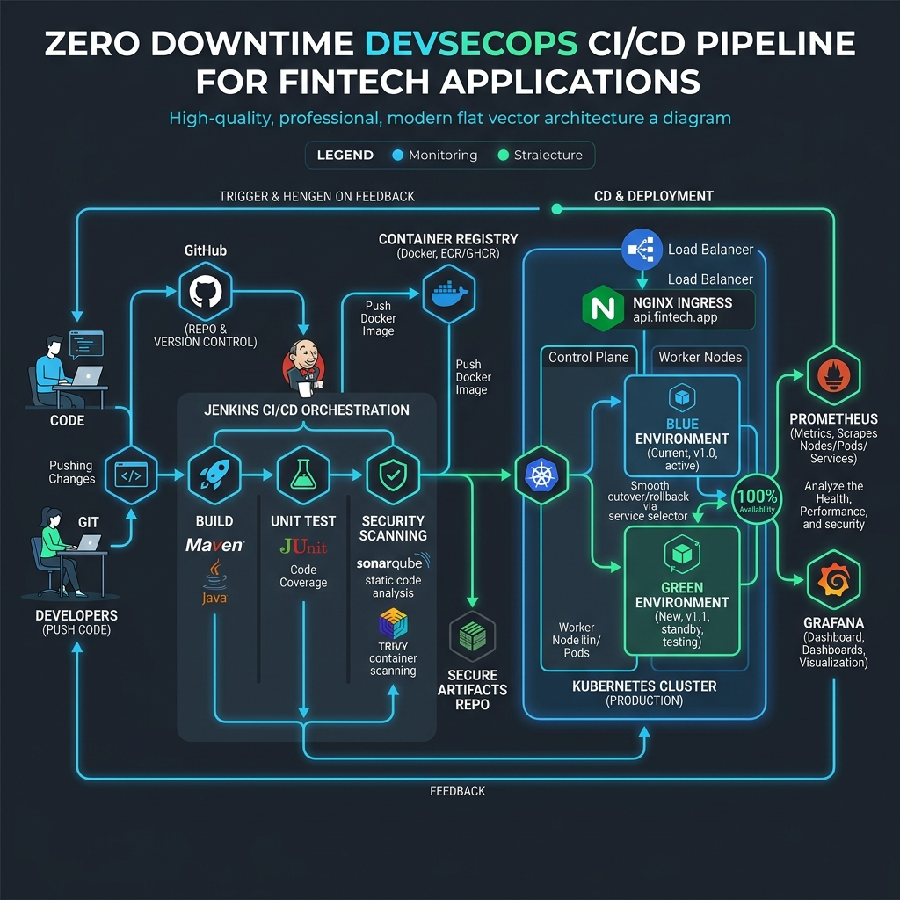

# Architecture Overview

## Zero Downtime CI/CD Pipeline for FinTech

This application follows a robust DevSecOps approach to ensure zero downtime and strict compliance, tailored for FinTech applications.

### Key Components

1. **Source Control**: GitHub (Feature branch workflows, pull requests, automated checks).
2. **CI/CD Server**: Jenkins handles orchestration of build, test, scan, and deploy phases.
3. **Build Tool**: Maven compiles the Java Spring Boot application.
4. **Code Quality & Security (SAST)**: SonarQube integrated to scan for vulnerabilities and code smells.
5. **Dependency Scanning**: OWASP Dependency Check ensures no vulnerable open-source components are used.
6. **Containerization**: Docker containerizes the application following best practices (least privilege, non-root user).
7. **Container Scanning**: Trivy scans Docker images for OS-level and application vulnerabilities before pushing to the registry.
8. **Deployment Environment**: Kubernetes (K8s) provides the runtime environment.
9. **Ingress Controller**: Nginx Ingress Controller routes external HTTP/S traffic to the internal services.
10. **Monitoring & Observability**: Prometheus aggregates metrics, and Grafana provides a visualization layer.

### Architecture Diagram

### High Availability & Disaster Recovery
- **Multi-Replica Deployments**: Applications are deployed with a minimum of 3 replicas.
- **Liveness and Readiness Probes**: Ensure K8s only sends traffic to healthy pods.
- **Multi-AZ K8s Cluster**: (Cloud Provider implementation) nodes span multiple availability zones for fault tolerance.
